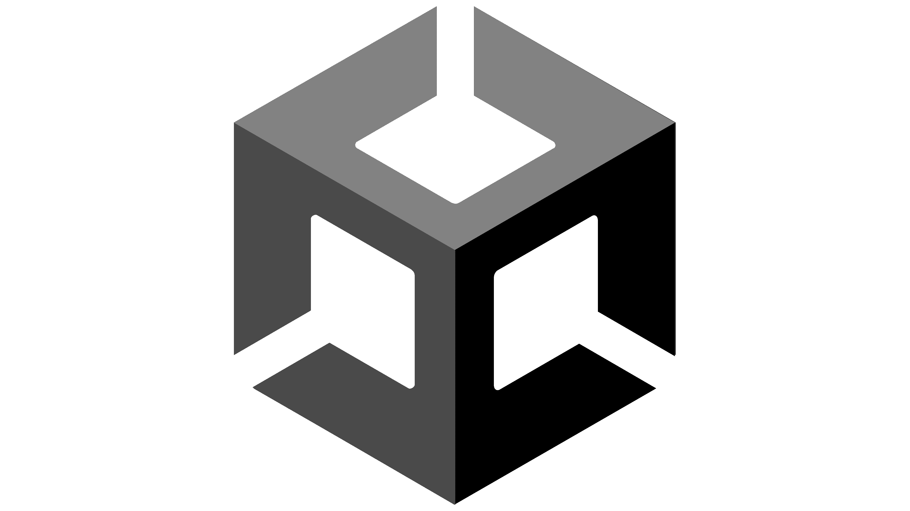

# About Peperehobbits01

Hi, I am Peperehobbits01! A small developer that likes to learn more, and that take time to make stuff correctly. Mostly working on my own project for now. I might help open source project, others then my own soon! I like privacy and think that it should be a standard. I am using Linux (not arch by the way) and I am working on what you could say big projects, like my Minecraft Modpack, The CreateWay SMP! 

# My skills right now and the ones I am learning

## The ones I know :

</a>

## The ones I am learning :

</a>

## The ones I want to learn :

</a>
